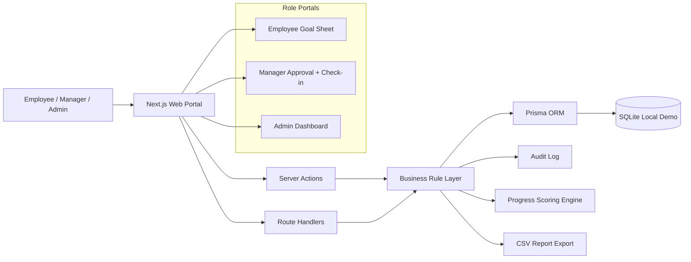

# Architecture Diagram

## Cost optimisation

- SQLite keeps local demo cost at zero.
- Next.js Server Actions avoid a separate backend service for the MVP.
- Prisma gives typed database access without manual SQL boilerplate.
- CSV export is generated server-side without paid reporting tools.
- PostgreSQL can be introduced only at deployment time.
