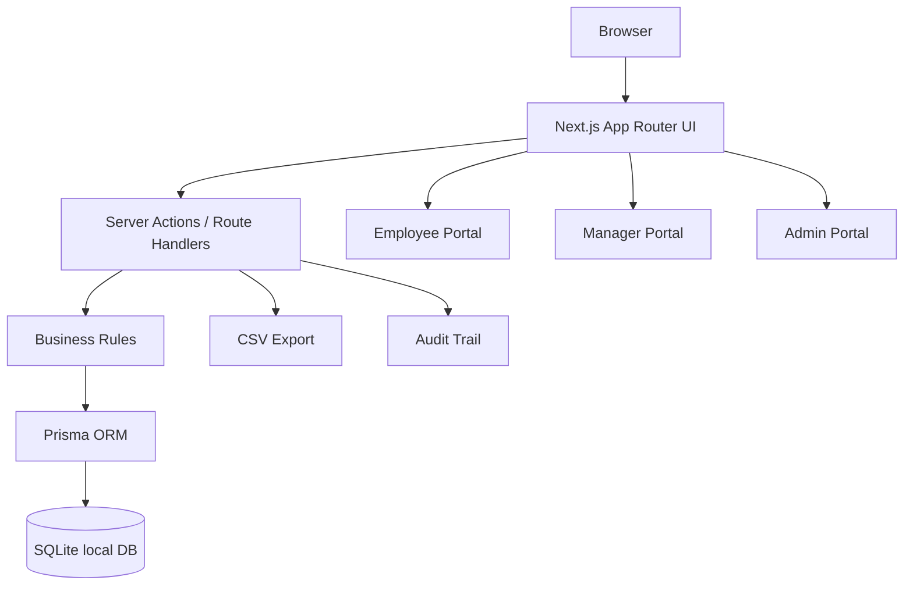

# AtomQuest Goal Setting & Tracking Portal

A functional MVP for the AtomQuest Hackathon 1.0 problem statement: employee goal creation, L1 manager approval, locked goal sheets, quarterly achievement capture, progress scoring, manager check-ins, admin dashboards, audit trail, shared goals, and CSV export.

## Tech stack

- Next.js App Router
- TypeScript
- Prisma ORM
- SQLite for local demo
- Tailwind CSS
- Server Actions

SQLite is used so the portal runs locally without Supabase, Neon, Docker, or cloud setup. To deploy, switch the Prisma datasource from SQLite to PostgreSQL and set a hosted `DATABASE_URL`.

## 1. Requirements

Install these on your Mac:

```bash
node -v
npm -v
```

Recommended: Node.js 20 or newer.

## 2. Run locally

```bash
cd atomquest-goals-portal
cp .env.example .env
npm install
npx prisma migrate dev --name init
npm run prisma:seed
npm run dev
```

Open:

```txt
http://localhost:3000
```

## 3. Demo credentials

All users use the same password:

```txt
Password: Demo1234
```

Users:

```txt
Employee: employee@demo.com
Manager:  manager@demo.com
Admin:    admin@demo.com
```

There is also a quick role switcher on the login screen for fast judging demos.

## 4. Recommended demo flow

### Employee journey

1. Login as `employee@demo.com`.
2. Open **Goals**.
3. Review/add goals.
4. Make sure total weightage is exactly `100%`.
5. Submit the goal sheet.

Validation rules implemented:

- Total weightage must equal `100%`.
- Minimum weightage per goal is `10%`.
- Maximum goals per employee is `8`.
- Approved goal sheets are locked.

### Manager journey

1. Login as `manager@demo.com`.
2. Open the pending employee goal sheet.
3. Edit target or weightage inline if needed.
4. Approve the sheet.
5. The sheet becomes locked.
6. Open check-in page for locked sheets and add a structured quarterly comment.

### Employee quarterly update

1. Login again as the employee whose sheet was approved.
2. Open **Quarterly Updates**.
3. Add actual achievement, completion date, status, and comment.
4. The system computes progress score based on UoM type.

### Admin journey

1. Login as `admin@demo.com`.
2. View completion dashboard.
3. Unlock a locked goal sheet as an exception.
4. Create a shared departmental KPI.
5. Open **Reports** and export CSV.
6. Open **Audit Logs** to see change history.

## 5. Progress score formulas

| UoM Type | Meaning | Formula |
|---|---|---|
| NUMERIC_MIN / PERCENT_MIN | Higher is better | Actual ÷ Target × 100 |
| NUMERIC_MAX / PERCENT_MAX | Lower is better | Target ÷ Actual × 100 |
| TIMELINE | Date-based completion | Completion date <= deadline gives 100% |
| ZERO | Zero = success | Actual 0 gives 100%, otherwise 0% |

All scores are clamped between 0 and 100.

## 6. Architecture



## 7. Folder structure

```txt
src/app/page.tsx                         Login and role switcher
src/app/employee/page.tsx                Employee dashboard
src/app/employee/goals/page.tsx          Goal creation and submission
src/app/employee/checkins/page.tsx       Quarterly achievement updates
src/app/manager/page.tsx                 Manager dashboard
src/app/manager/approvals/[sheetId]      Manager approval workflow
src/app/manager/checkins/[sheetId]       Manager check-in workflow
src/app/admin/page.tsx                   Admin dashboard and shared KPIs
src/app/admin/reports/page.tsx           Achievement report
src/app/admin/audit/page.tsx             Audit trail
src/app/api/reports/achievement.csv      CSV export route
src/app/actions.ts                       All server-side mutations
src/lib/scoring.ts                       Progress score formulas
src/lib/goal-validation.ts               Goal sheet validation rules
prisma/schema.prisma                     Database schema
prisma/seed.ts                           Demo data
```

## 8. Deployment notes

For Vercel deployment with PostgreSQL:

1. Create a PostgreSQL database on Supabase, Neon, Railway, or Prisma Postgres.
2. Change `prisma/schema.prisma` datasource provider:

```prisma
datasource db {
  provider = "postgresql"
  url      = env("DATABASE_URL")
}
```

3. Set `DATABASE_URL` in hosting environment variables.
4. Run:

```bash
npx prisma migrate deploy
npm run build
```

## 9. Known MVP simplifications

- Authentication is demo-grade. It uses seeded users and cookies, not production SSO.
- SQLite is used for local portability.
- Email, Microsoft Teams, and Azure Entra ID are architecture-ready but not implemented.
- Shared goals are implemented as departmental KPI push with linked goal rows.

## V2 interaction upgrades

This version adds a more demo-friendly layer on top of the original MVP:

- Interactive employee goal builder with goal templates.
- Live projected weightage meter before adding a goal.
- UoM-specific helper text and dynamic target fields.
- Toast-style success/error feedback from URL query results.
- Employee lifecycle progress card.
- Employee weightage distribution chart.
- Live quarterly achievement score preview before saving.
- Manager dashboard search and status filtering.
- Manager approval readiness meter.
- Manager check-in score progress bars.
- Admin charts for status mix and department completion.
- Admin searchable/filterable governance table.

After replacing files or using the updated ZIP, run:

```bash
npm install
npx prisma generate
npm run dev
```

If your local database already exists, you do not need to migrate again unless you changed the Prisma schema. This V2 UI upgrade does not require a schema change.

## V3 compliance upgrade: cycle windows

This version adds two BRD compliance improvements:

1. **Quarterly check-in schedule enforcement**
   - Goal creation, goal edits, goal submission, manager inline edits, manager approval, return-for-rework, and shared KPI pushes are allowed only during the configured Goal Setting window.
   - Employee achievement updates and manager check-in comments are allowed only for the currently open quarter.
   - Closed quarters remain visible for review, but save actions are disabled in the UI and blocked again server-side.

2. **Admin Cycle Management UI**
   - Admins can manage the active cycle at `/admin/cycles`.
   - Admins can edit the active cycle name, year, and window dates.
   - Admins can create inactive future cycles and activate one cycle at a time.
   - Cycle changes are written to the audit log as `GOAL_CYCLE` events.

For immediate demo testing, login as Admin and open **Cycles**. To make Q1 capture available today, set **Q1 Opens** to today and keep **Q2 Opens** in the future.
